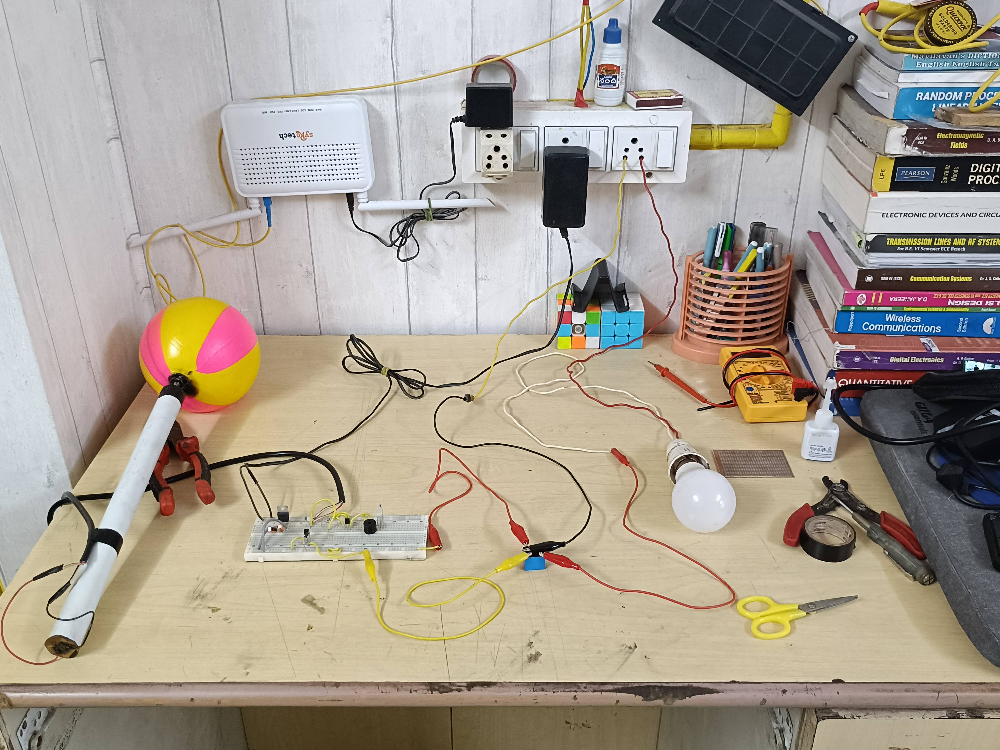
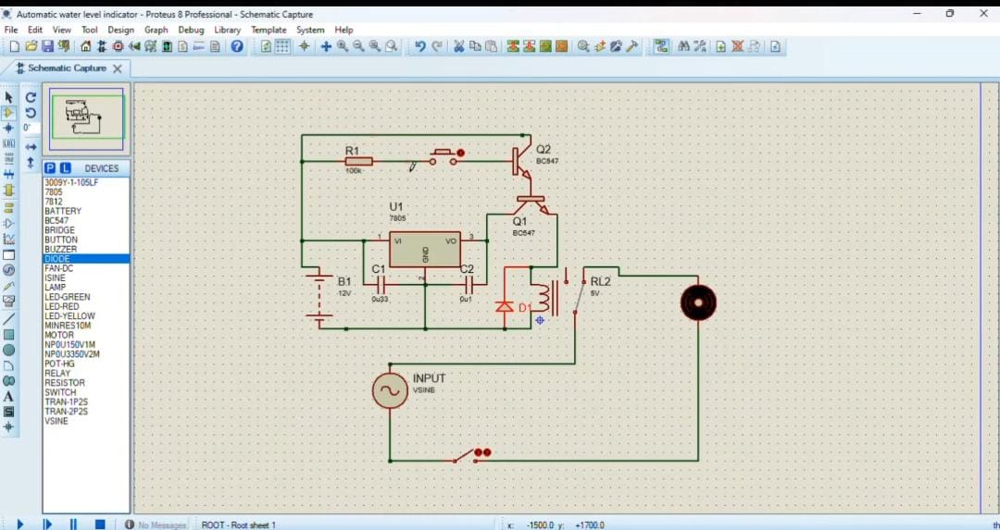

# 💧 Smart Water Level Indicator with Auto Cutoff

## 📘 Project Description

This project is designed to **prevent water tank overflow** by automatically switching **OFF the motor** when the tank is full. It is a simple, low-cost, and effective solution to **save water and electricity**, especially useful in households where manual monitoring of motor/tank levels is inconvenient.

---
# Prototype

## 🎯 Problem Statement

Water tank overflows due to the motor being left ON manually. This leads to:
- Unnecessary **water wastage**
- **Increased electricity bills**
- **Manual dependency** to monitor the tank status

---

## ✅ Proposed Solution

The solution is a **mechanical switch system** based on a **floating plastic ball**:

- A **plastic ball** floats on the surface of the water inside the tank.
- When the tank fills up, the ball **rises to the top**.
- The ball is connected to a **mechanical switch** at the tank lid.
- When triggered, this switch:
  - Activates a circuit that **cuts off the motor** using a relay.
  - Turns ON a **red LED** and **buzzer** as alerts.
  
The circuit involves basic electronic components and uses **BC547 transistor**, **7805 voltage regulator**, **relay**, and supporting components.

---
# Simulation (Proteus)

## 🧰 Components Used

| Component              | Quantity | Description                                   |
|------------------------|----------|-----------------------------------------------|
| Plastic Ball           | 1        | Floats to detect the full water level         |
| Mechanical Switch      | 1        | Triggered when the water is full              |
| BC547 Transistor       | 1        | Acts as a switch for the relay                |
| Resistors              | Few      | Voltage divider and transistor biasing        |
| 7805 Voltage Regulator | 1        | Steps down 12V to 5V DC                       |
| 5V Relay Module        | 1        | Controls the water pump motor                 |
| Red LED                | 1        | Indicates the tank is full                    |
| Buzzer                 | 1        | Audio alarm when tank is full                 |
| Diode (1N4007)         | 1        | Protects from reverse EMF                     |
| Capacitors             | 2        | Filters noise at 12V and 5V supply            |
| Water Pump Motor       | 1        | Motor being controlled                        |

---

## 🔌 Circuit Block Diagram (ASCII Art)
         +---------------------------+
         |     Water Tank (Top)      |
         |                           |
         |     [Floating Ball]       |
         |           │               |
         |           ▼               |
         |     [Mechanical Switch]   |
         +------------┼--------------+
                      │
           +----------▼-----------+
           |     BC547 Transistor |
           +----------┼-----------+
                      │
         +------------▼-----------+
         |       Voltage Divider   |
         +------------┼-----------+
                      │
           +----------▼----------+
           |       5V Relay      |
           +----┬-------┬--------+
                │       │
        +-------▼+     +▼--------+
        |   LED   |     Buzzer   |
        +-------++     ++--------+
                │       │
                └────┬──┘
                     │
           +---------▼-----------+
           |     Water Motor     |
           +---------------------+

---

## ⚙️ Working Principle

1. **Power Supply**: 12V input regulated to 5V using 7805 and filtered using capacitors.
2. **Switch Trigger**: Mechanical switch closes when floating ball rises with water level.
3. **Transistor Control**: BC547 turns off the relay when triggered.
4. **Motor Control**: Relay disconnects motor supply.
5. **Alert**: Red LED lights up and buzzer sounds.

---

## 💡 Benefits

- 💧 Prevents water overflow
- ⚡ Saves electricity by auto-cutoff
- 👨‍🔧 No microcontroller required
- 🔋 Simple, cost-effective mechanical-electronic hybrid solution

---

## 📂 How to Use

1. Mount the **plastic ball** in the water tank cap using a hinge so it can lift freely.
2. Connect the **mechanical switch** to be triggered by the ball’s upward movement.
3. Assemble the **relay and circuit components** as per the schematic.
4. Connect the relay output to the **motor supply line**.
5. When the tank is full, the system automatically cuts power to the motor and activates **alerts**.

---
Full video here 👇
## 📽️ Watch Demo Video

🔗 [Watch the prototype in action](#) *(https://youtu.be/RxTgxVklkms)*

## 🧠 Future Improvements

- Add a microcontroller (e.g., Arduino) for more control and monitoring.
- Add an LCD or mobile alert system via IoT.
- Add dry-run protection and water source detection.

-----
